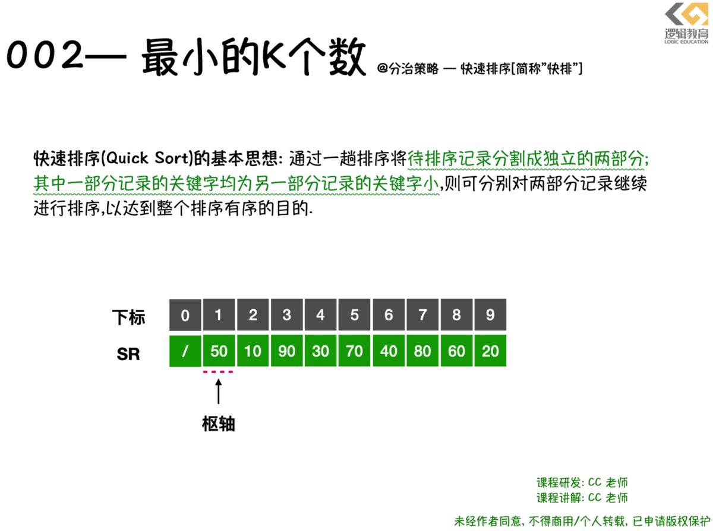

# 002--算法之"高手过招"\[最小K个数\]

### 1.1 最小K个数

* \*\*难度系数: ☆☆☆☆
* **题目来源: LeetCode 下分治策略专题**
* **题目描述: 设计一个算法, 找出数组中最小的k个数. 以任意顺序返回这k个数均可;**
* 输入:arr = \[1,3,5,7,2,4,6,8\] , k = 4;
* 输出: \[1,2,3,4\]
* **提示:**
* 0 &lt;= len\(arr\) &lt;= 100000
* 0 &lt;= k &lt;= min\(100000, len\(arr\)\)
* 题目解读:
* 这个问题就是想要你从10w 个数字找出 最小的k 个数;
* **关键词: 数量级10w, 最小的k个数 , 返回顺序任意;**
* **出现过企业面试题: 字节跳动,腾讯**

### 1.2 快排实现最小K个数

**LeetCode 执行结果**


#### 问题分析:

其实这个问题就是一个非常经典的快排问题. 但是大多数人遇到这个问题时 总是被 前面的数量级 总认为这样的问题无法通过排序算法完成. 问题的表现形式,常常用以下方式描述: **"如何从10万个数中找到最大的100个数"**. 实际上这个问题就是今天我们要探讨的 算法题. \*\* 设计一个算法, 找出数组中最小的k个数. 以任意顺序返回这k个数均可; \*\*

**这个问题在LeetCode 上"分治策略"题库标签下, 实际上使用快速排序就是一种非常典型且明显的分治策略了. 快速排序\(Quick Sort\)的基本思想: 通过一趟排序将待排序记录分割成独立的两部分; 其中一部分记录的关键字均为另一部分记录的关键字小. 则可分别对两部分记录继续进行排序, 以达到整个排序有序的目的;**

值得注意的地方是, **使用快速排序后会让源数据的数据位置发生变化**. 但是在这样的改变题目中明确指出是可以被允许的. 这个细节也是面试官会和你讨论的一个小细节;  
  


### 1.3 快速排序思想

快速排序其实就是冒泡排序的升级, 它们都属于交换排序;

快速排序也是通过不断的比较和移动交换来实现排序的.只不过它的实现,增大了记录的比较和移动的距离; 将关键字较大的记录从前面直接移动到后面; 关键字较小的记录从后面直接移动到前面,从而减少了总的比较次数和移动交换次数;  
  




从快速排序的思想字母以上看, 好像这样的计算是非常复杂且繁琐的. 但是并非如此. 接下来我们就跟着 我的文字, 来快速理解, 快速排序的思路.


```text
                               
```

**设计一个smallestK 函数思路:**

* **判断当前的数组是否为空/数组长度是否小于0,以及查找的k数是否小于0,返回的size是否赋予了对应的地址空间;**
* **low = 0, hight = arrSize -1;**
* **求得枢轴,并且将数组枢轴左边的关键字都比它小, 右边的关键字都比枢轴对应的关键字大;**
* **将数组一分为二,对低子表进行排序,对高子表进行排序;**
* **排序结束后,将数组arr 中前k个数据存储到 ans 数组中并返回;**

**那么我们来看看 \*\*\*\*smallestK 的代码实现:**  
  


```c
void QSort(int *arr, int low, int hight){
    int pivot ;
    if (low < hight) {
         //将L->r[low,high]一分为二,算出中枢轴值 pivot;
        pivot = Partition2(arr, low, hight);
        
        printf("arr[%d] = %d\n",pivot,arr[pivot]);
        //对低子表递归排序;
        QSort(arr, low, pivot-1);
         //对高子表递归排序
        QSort(arr, pivot+1, hight);
    }
}

int* smallestK2(int* arr, int arrSize, int k, int* returnSize){
    //1.判断数组是否为空,且arrsize 小于0则不符合排序的前提;
    //1.判断寻找最小的K数,且returnSize 空间是否开辟成功,不符合则返回Null
    if(arr == NULL || arrSize <= 0 || k <= 0 || returnSize == NULL){
        if(returnSize != NULL) *returnSize = 0;
        return NULL;
    }
       
    //进行快速排序QSort
    QSort(arr, 0, arrSize);
    
    //4. 创建一个数组reslut, 数组长度为k;
    int* reslutArr = malloc(sizeof(int) * k);
    *returnSize = k;
    //循环将排序后的arr数组中的前k个元素存储到数组reslutArr 中;
    for(int i = 0; i < k; i++){
        reslutArr[i] = arr[i];
    }
    
    return reslutArr;
}
```


* `QSort (L,1,L->length)` 中的`1`和`L->Length`代码的意思,其实就是对当前待排序的最小下标值`low`和最大下标值`high`.
* 这段代码的核心就是求解枢轴;`pivot = Partition(L,low,high)`. 在执行之前`,L.r`数组值为`{50,10,90,30,70,40,80,60,20}.`
* `Partition` 函数要做的,**就先选取当中一个关键字.比如选择第一个关键字50. 然把它放在一个位置上,使得它左边的值都比它小, 右边的值都比它大. 我将这样的关键字称为枢轴\(pivot\);**
* 经过`Partition(L,1,9)`之后,数组变成了 `{20,10,40,30,50,70,80,60,90}`; 并返回了5给`pivot`. 数字5表示50放置在数组下标为5的位置.
* 此时把原来位于50左右的2个数组`{20,10,40,30}`和`{70,80,60,90}`.
* 后面的递归就是调用 Q`Sort(L,1,5-1),QSort(L,5+1,9)`. 其实就是对`{20,10,40,30}`和`{70,80,60,90}`. 分别同样进行`Partition` 操作,直到顺序全部正确为止;

注意,在 QSort 函数中,最关键的是**Partition2** 函数 . 这个函数的作用是:

**Partition2函数的功能**

1. **选取当中一个关键字作为枢轴;**
2. **将它放在一个合适的位置上, 使得它的左边的值都比它小, 右边的值都比它大;**

### 1.4 Partition 函数的实现与分析

既然我们明确了 **Partition 的作用.** **就先选取当中一个关键字.比如选择第一个关键字50. 然把它放在一个位置上,使得它左边的值都比它小, 右边的值都比它大. 我将这样的关键字称为枢轴\(pivot\);**

那么接下来,**我们要解决的问题是:**

1. **那么如何寻找枢轴变量?**
2. **如果将枢轴变量放在合适的位置,并且使得左侧关键字均比它小,且右侧的均比它大;**

  


* 我们选择子表中第**1**个记录作为枢轴变量,`pivotkey = 50；`
* 从表的两端往中间扫描; 开始第1层循环! 循环判断依据是`low<high`
* **用高位`high` 与 `pivotkey` 进行比较找到比枢轴小的记录. 交换到低端位置上**;
* 比较数组`L->r[high]` 与 `pivotkey` 进行比较. 如果`low<hight` 并且 `L->r[high] >= pivotkey` 就递减`high`;

  


* 判断依据: `L->r[high] >= pivotkey && low < high` 循环则继续往下查找. `high` 递减;
* **此时**, 如图. 当`high = 9, low = 1; L->r[9] = 20; L->r[1] = 50`; 所以不满足循环条件,退出循环, 那么此时需要交换`Swap(L,1,9)`; 使得比pivotkey 小的数据,交换到低端位置上;

  
  


* 接下来, **用低位`low` 与 `pivotkey` 进行比较找到比枢轴大的记录. 交换到高端位置上;**
* 判断依据: `L->r[low] >= pivotkey && low < high`循环则继续往下查找. `low++`;
* 此时,`L->r[1] = 20, pivotkey = 50; L->r[low] < pivotkey; 则low++; low = 2;`

``

* 此时`L->r[2] = 10, pivotkey = 50; L->r[low] < pivotkey; 则low++; low = 3`;
* 此时`L->r[3] = 90, pivotkey = 50; L->r[low] > pivotkey`; 则循环退出.
* 交换`L->r[low] 与 L->r[high]的值; swap(L ,3,9)`;


* 第1次 往中间扫描结束!
* 但是此时`low < high . low = 3,high = 9`. 还可以继续进行第2次 往中间两端交替向中间扫描;

**Partition 函数的思路**:

* 选取第一个关键字作为枢轴;
* 只要\(low &lt; high\) 就循环持续的将表的两端进行交替向中间扫描 **\(\*\*\*\*&lt;u&gt;两端交替循环&lt;/u&gt;**\)
* while 遍历从\[low,high\]的高端位置开始找,找到比枢轴小的关键字\(**&lt;u&gt;高位调整循环&lt;/u&gt;**\)
* 如没有找到,则修改范围. 将high 递减;
* 如果找到进行交换到低端位置 swap\(L,low,high\);
* while 遍历从\[low,high\]的低端位置开始找,找到比枢轴大的关键字\(**&lt;u&gt;低位调整循环&lt;/u&gt;**\)
* 如果没有找到,则修改范围,将low 递增;
* 如果找到进行交换到高端位置 swap\(L,low,high\);

**Partition 代码实现:**  
  


```c
//③交换顺序表L中子表的记录，使枢轴记录到位，并返回其所在位置
//此时在它之前(后)的记录均不大(小)于它
int Partition(SqList *L,int low,int high){
    int pivokey;
    //pivokey 保存子表中第1个记录作为枢轴记录;
    pivokey = L->r[low];
    //① 从表的两端交替地向中间扫描;
    while (low < high) {
        
        //② 比较,从高位开始,找到比pivokey更小的值的下标位置;
        while (low < high &&  L->r[high] >= pivokey)
            high--;
        //③ 将比枢轴值小的记录交换到低端;
        swap(L, low, high);
        //④ 比较,从低位开始,找到比pivokey更大的值的下标位置;
        while (low < high && L->r[low] <= pivokey)
            low++;
        //⑤ 将比枢轴值大的记录交换到高端;
        swap(L, low, high);
        
    }
    
    //返回枢轴pivokey 所在位置;
    return low;
}
```

最小K个数\[快速排序实现策略\]完整代码实现

```c
int Partition2(int *L,int low,int high){
    
    int pivotkey;
    pivotkey = L[low];
    while (low < high) {
        while (low < high && L[high] >= pivotkey)  high--;
        swap(L+low, L+high);
        while (low < high && L[low] <= pivotkey) low++;
        swap(L+low, L+high);
        
    }
    return low;;
}

void QSort(int *arr, int low, int hight){
    int pivot ;
    if (low < hight) {
        pivot = Partition2(arr, low, hight);
        
        printf("arr[%d] = %d\n",pivot,arr[pivot]);
        QSort(arr, low, pivot-1);
        QSort(arr, pivot+1, hight);
    }
}

int* smallestK2(int* arr, int arrSize, int k, int* returnSize){
    //1.判断数组是否为空,且arrsize 小于0则不符合排序的前提;
    //1.判断寻找最小的K数,且returnSize 空间是否开辟成功,不符合则返回Null
    if(arr == NULL || arrSize <= 0 || k <= 0 || returnSize == NULL){
        if(returnSize != NULL) *returnSize = 0;
        return NULL;
    }
 
    QSort(arr, 0, arrSize);
    
    //4. 创建一个数组reslut, 数组长度为k;
    int* reslutArr = malloc(sizeof(int) * k);
    *returnSize = k;
    //循环将排序后的arr数组中的前k个元素存储到数组reslutArr 中;
    for(int i = 0; i < k; i++){
        reslutArr[i] = arr[i];
    }
    
    return reslutArr;
}

#define N 9
int main(int argc, const char * argv[]) {
    // insert code here...
    printf("Hello, World!\n");

    int d[10]={1,3,5,7,2,4,6,8,9};
    int resultSize;
    int *result = smallestK2(d, 8, 4, &resultSize);
    for (int i = 0; i < resultSize; i++) {
        printf("%d \n",result[i]);
    }
    
    
    return 0;
}
```

  


